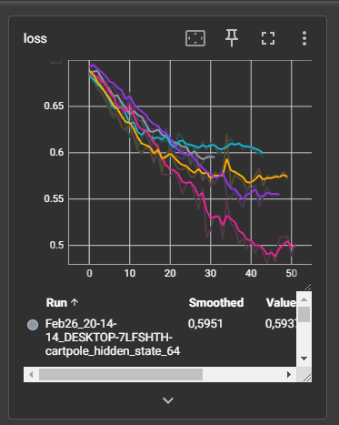
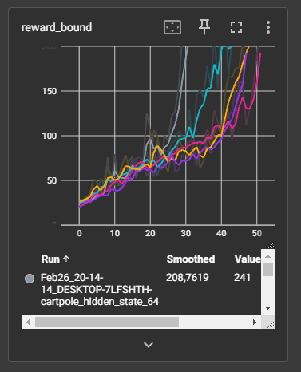
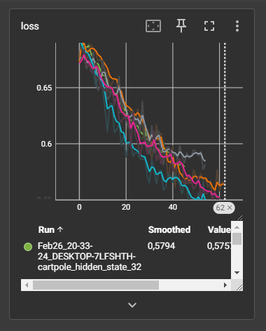
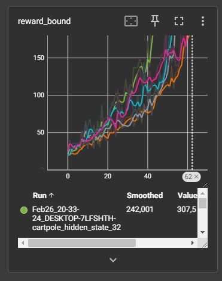
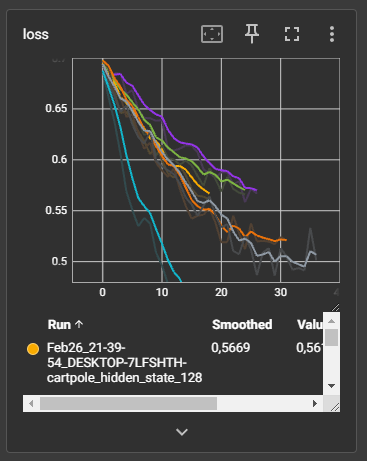
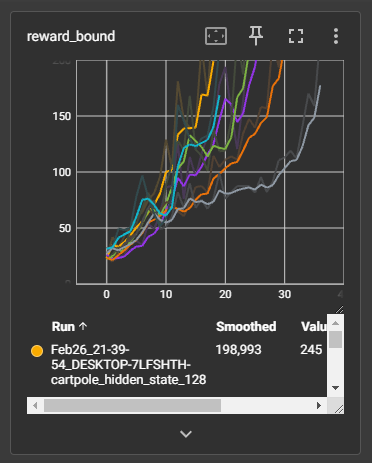
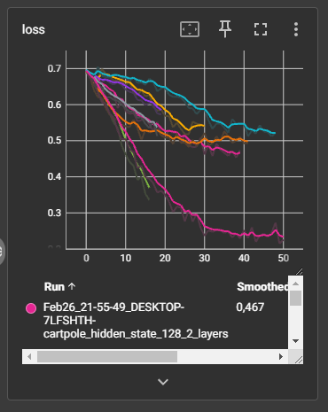
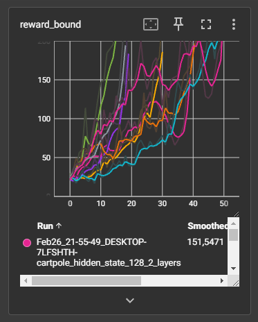

# Отчет 1. Исследование метода кросс-энтропии в среде Cartpole 

## Задание 1. Исследование скрытых слоев
При начальном значении `hidden_state=64` сходимость достигалась за различное количество итераций: от 31 до 52.
Число примеров: 5
Графики функции потерь и среднего вознаграждения приведены ниже:





При увеличении значения `hidden_state` до 128 сходимость располагается между 13 и 36. Показатель слегка
увеличился.
Число примеров: 6
Графики функции потерь и среднего вознаграждения приведены ниже: 





При уменьшении значения `hidden_state' до 32 слегка увеличило количество итераций до сходимости:
от 47 до 62. Но в глобальном смысле сильной разницы нет.
Число примеров: 5
Графики функции потерь и среднего вознаграждения приведены ниже:





## 2. Архитектура нейросети (3 балла)
Начальная архитектура имеет следующий вид: 
```
nn.Linear(obs_size, hidden_size),
nn.ReLU(),
nn.Linear(hidden_size, n_actions)
```
Значение `hidden_size=64`. 
Для этой архитектуры сходимость достигается за количество итераций (от 31 до 47). 
Проверим, что будет, если мы добавим еще один скрытый слой, архитектура сети будет выглядть
следующим образом:
'''
nn.Linear(obs_size, hidden_size1),
nn.ReLU(),
nn.Linear(hidden_size1, hidden_size2),
nn.ReLU(),
nn.Linear(hidden_size2, n_actions),
'''
В таком случае показатели шагов до сходимости изменились с 16 до 50 при 8 испытаниях.
Можно сказать, что нет никакой разницы при добавлении нового слоя в архитектуру нашей
нейронной сети.
Графики функции потерь и среднего вознаграждения приведены ниже:





## 3. Видео отчет (2 балла)
Лучший результат показала архитектура, которая имеет следующий вид: 
```
nn.Linear(obs_size, hidden_size),
nn.ReLU(),
nn.Linear(hidden_size, n_actions)
```
Значение `hidden_size=128`. 
Для этой архитектуры сходимость достигается в среднем за количество итераций (от 13 до 36). 
Видео с примером работы агента приведено ниже.
Видео может не вставляться, хотя вроде делал все по туториалам, так или иначе, оно лежит в папке mp4 в seminar_2

<video src="mp4/rl-video-episode-343.mp4" width="240"/>